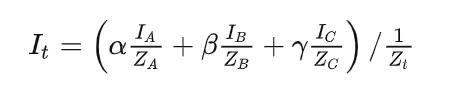

# SoftRenderer
This is a very tiny software rasterization applicaiton for understanding basic CG knowledge 

 #Main Features
 - movable camera
 - Perspective correct interpolation
 - Back-face culling
 - Homogeneous clipping
 - Back-face culling
 - Blinn-Phong shading
 - Cubemap skybox
 - basic obj model loader

 # Result

 # Problem encountered
![falseInterpolate] (./experience/FalseInterpolate_INVZ_View.gif)

 - Finally, I found that it's the Perspective correct interpolation problem\
\
 To be faster, I put the Zt in the parenthesis, which means I use alpha' = alpha / Za * Zt \
 In this way, I will no longer care the Perspective correct, just use alpha', beta', gamma' to compute\
But the error comes..

 - After fix bugs\
![TrueInter] (./experience/TrueINTER_invz.gif)

# Reference
https://github.com/SunXLei/SRender

# Plan
 - math lib
 - platform io
 - setup basic framework and draw basic triangle to verity
 - camera and verify rotate and drag
 - rasterize func
 - texture load
 - basic model, basic shader to handle data
 - fix bugs
 - complete pipeline including backface clipping, clipping space interpolate and clipping, larger z clipping    
 - fix bugs
 - load complex model and their resources
 - Blin-PhongShader \
--------------------------- current --------------------
 - PBR, IBL shader
 - try TBB or any multi thread methods to speed up
 - ...
