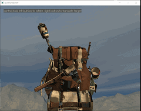

# SoftRenderer
This is a very tiny software rasterization applicaiton for understanding basic CG knowledge 

 #Main Features
 - movable camera
 - Perspective correct interpolation
 - Back-face culling
 - Homogeneous clipping
 - Back-face culling
 - Blinn-Phong shading
 - Cubemap skybox
 - basic obj model loader

 # Result

# Plan
 - math lib
 - platform io
 - setup basic framework and draw basic triangle to verity
 - camera and verify rotate and drag
 - rasterize func
 - texture load
 - basic model, basic shader to handle data
 - fix bugs
 - complete pipeline including backface clipping, clipping space interpolate and clipping, larger z clipping    
 - fix bugs
 - load complex model and their resources
 - Blin-PhongShader and PBR shader
--------------------------- current --------------------
 - try TBB or any multi thread methods to speed up
 - ...